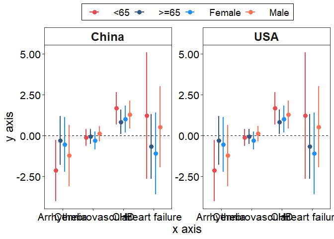

<!-- README.md is generated from README.Rmd. Please edit that file -->

# ggfp: Easy way to draw a forest plot (fp) with ggplot2(gg) 

[](https://lifecycle.r-lib.org/articles/stages.html)
[](https://cran.r-project.org/web/packages/devtools/index.html)
[](https://github.com/lizhiwei1994/ggfp/issues)

## :bar_chart: Overview

The goal of `ggfp` is to simplify the process of drawing forest plots
using ggplot2. We have packaged the main code for drawing forest plots
to form the `gg_fp()` function. `gg_fp()` has the advantage that only a
few parameters need to be provided to draw a nice forest plot. Of
course, it also has the obvious disadvantage that some of the more
fine-grained graph adjustment parameters are not available in `gg_fp()`.

## :arrow_double_down: Installation

You can install the development version of ggfp like so:

``` r
devtools::install_github('lizhiwei1994/ggfp)
```

## :beginner: Usage

We use the data built into the `ggfp` package for the demonstration.
After you library the `ggfp` package, you can import the example data
into R with the following code.

``` r
library(ggfp)
data('example_data', package = 'ggfp')
```

This is a basic example which shows you how to solve a common problem:

``` r
library(ggfp)

gg_fp(
  data = example_data,
  x_axis = Disease,
  point = PC,
  low = PC_95_LOW,
  up = PC_95_UP,
  group_var = group,
  facet_var = country,
  facet_color = c(rep('white', 2)),
  group_color = c("#ea4a50", "#325788", "dodgerblue", "coral1"),
  point_shape = c(16, 16, 16, 16)
  
)
```



You can change the facet strip color by giving `color name` or
`hexadecimal colors` to `facet_color`.

``` r
gg_fp(
  data = example_data,
  x_axis = Disease,
  point = PC,
  low = PC_95_LOW,
  up = PC_95_UP,
  group_var = group,
  facet_var = country,
  facet_color = c('skyblue', '#d9d9d9'),
  group_color = c("#ea4a50", "#325788", "dodgerblue", "coral1"),
  point_shape = c(16, 16, 16, 16)
  
)
```


Change the axis labels by `label.x` and `label.y`. Change the number of
decimal places displayed on the y-axis via `point.digit`.

``` r
gg_fp(
  data = example_data,
  x_axis = Disease,
  point = PC,
  low = PC_95_LOW,
  up = PC_95_UP,
  group_var = group,
  facet_var = country,
  facet_color = c('skyblue', '#d9d9d9'),
  group_color = c("#ea4a50", "#325788", "dodgerblue", "coral1"),
  point_shape = c(16, 16, 16, 16),
  label.x = 'Disease',
  label.y = 'Percentage Change and 95% CI',
  point.digit = 0.001
)
```


> Note: `gg_fp()` sets a base for the font size. For `axis.title` and
> `strip.text` it is `14`, for other fonts it is `12`. So the fonts will
> overlap when displayed in the readme. It is recommended to save the
> ggfp figure with `width = 14`, `height = 8`.

## :page_with_curl: About Author

Zhiwei Li (<lizhiwei@ccmu.edu.cn>)

Department of Epidemiology and Health Statistics

School of Public Health, Capital Medical University

No.10 Xitoutiao, Youanmen Wai Street

Beijing, 100069
